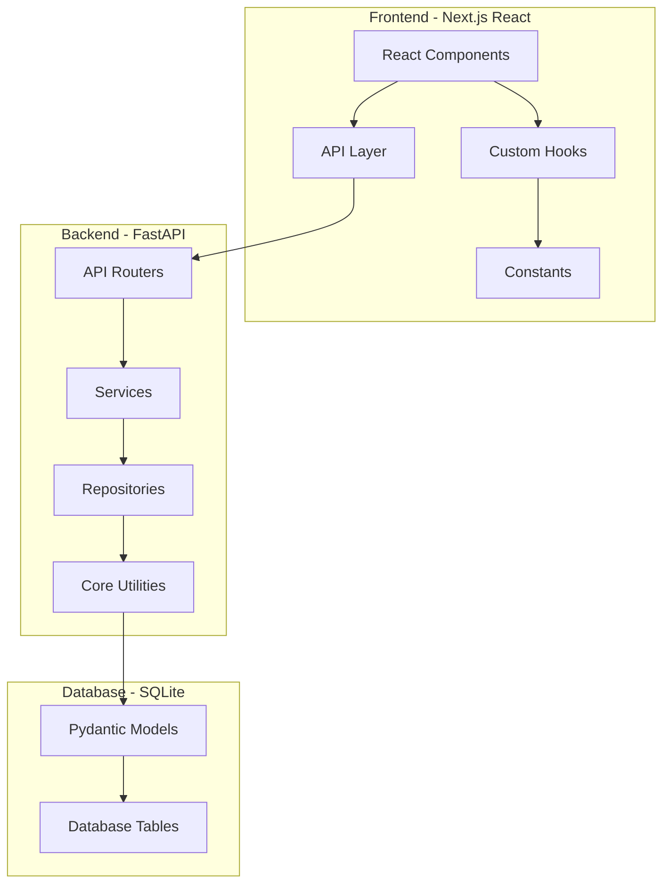

# SenstoSales ERP - Comprehensive Architecture Review

## Executive Summary

This document provides a comprehensive architecture review of the SenstoSales ERP system, covering both backend (Python/FastAPI) and frontend (TypeScript/React) layers. The review identifies architectural strengths, areas for improvement, and provides prioritized recommendations for future development.

---

## 1. Architecture Overview

### 1.1 System Architecture Diagram



### 1.2 Technology Stack

| Layer | Technology | Version |
|-------|------------|---------|
| Frontend | Next.js / React | Latest |
| Frontend | TypeScript | Latest |
| Frontend | Ant Design | Latest |
| Backend | FastAPI | Latest |
| Backend | Python | 3.11+ |
| Database | SQLite | 3.x |
| ORM | Pydantic | 2.x |

---

## 2. Backend Architecture Analysis

### 2.1 Layer Structure

```
backend/
├── api/           # API Router Layer
├── core/          # Core utilities and configurations
├── db/           # Database connection and models
├── repositories/ # Data access layer
├── services/     # Business logic layer
├── middleware/   # HTTP middleware
└── utils/        # Utility functions
```

### 2.2 Strengths

#### 2.2.1 Clean Separation of Concerns
- **API Layer** (`backend/api/`): Handles HTTP routing and request validation
- **Service Layer** (`backend/services/`): Contains business logic
- **Repository Layer** (`backend/repositories/`): Data access abstraction
- **Core Layer** (`backend/core/`): Shared utilities and configurations

#### 2.2.2 Well-Defined Exception Hierarchy
The exception system in [`backend/core/exceptions.py`](backend/core/exceptions.py) provides:
- Base `AppException` class with standardized error codes
- Specific exception types: `ResourceNotFoundException`, `BusinessRuleViolation`, etc.
- HTTP status code mapping via `map_error_code_to_http_status()`
- Legacy compatibility layer for backward compatibility

#### 2.2.3 Result Pattern for Service Layer
The [`backend/core/result.py`](backend/core/result.py) implements a standardized `ServiceResult` container:
- Enforces explicit success/failure handling
- Provides `ok()` and `fail()` factory methods
- Generic type support for type-safe data handling

#### 2.2.4 Centralized Constants
Created [`backend/core/constants.py`](backend/core/constants.py) with:
- Tax rates (CGST, SGST, IGST)
- Batch operation sizes
- Pagination limits
- Financial year patterns

### 2.3 Areas for Improvement

#### 2.3.1 Repository Layer - Complex Queries
The DC repository ([`backend/repositories/dc_repository.py`](backend/repositories/dc_repository.py)) contains complex SQL with multiple subqueries that could be optimized:

```python
# Example: Complex aggregation in list_dcs_paginated
COALESCE((
    SELECT SUM(dci.dsp_qty * poi.po_rate)
    FROM delivery_challan_items dci
    JOIN purchase_order_items poi ON dci.po_item_id = poi.id
    WHERE dci.dc_number = dc.dc_number
), 0) as total_value
```

**Recommendation**: Consider creating SQL views or using JOINs instead of subqueries for better performance.

#### 2.3.2 Middleware Limitations
The [`backend/middleware/performance.py`](backend/middleware/performance.py) only logs slow requests but doesn't:
- Track metrics over time
- Alert on performance degradation
- Collect performance data for analysis

**Recommendation**: Integrate with the existing Nexus/Diagnostics system for comprehensive monitoring.

#### 2.3.3 Error Handling Inconsistency
Some services use `logger.error()` with `exc_info=True` instead of `logger.exception()`.

**Recommendation**: Standardize to `logger.exception()` for all error logging.

---

## 3. Frontend Architecture Analysis

### 3.1 Component Structure

```
frontend/
├── app/              # Next.js App Router pages
├── components/
│   ├── common/       # Shared UI components
│   └── modules/      # Feature-specific components
├── hooks/            # Custom React hooks
├── constants/        # Application constants
└── lib/              # Utility libraries
```

### 3.2 Strengths

#### 3.2.1 Well-Organized Component Architecture
- **Common Components** (`common/`): Reusable UI elements (DataTable, Pagination, etc.)
- **Module Components** (`modules/`): Feature-specific components organized by domain
- **Type Definitions**: Each module has dedicated type files (`types/index.ts`)

#### 3.2.2 Centralized Constants
Created [`frontend/constants/performance.ts`](frontend/constants/performance.ts) with:
- API and caching configuration
- Debouncing delays
- Pagination settings
- Animation durations
- Validation rules

#### 3.2.3 Reusable Hook Patterns
Implemented custom hooks that follow best practices:
- [`useDetailActions.ts`](frontend/hooks/useDetailActions.ts) - Standardized edit/save/cancel pattern
- [`useConfirmationModal.ts`](frontend/hooks/useConfirmationModal.ts) - Delete confirmation modal pattern
- [`useFetch.ts`](frontend/hooks/useFetch.ts) - Type-safe fetch with exponential backoff
- [`useCachedAPI.ts`](frontend/hooks/useCachedAPI.ts) - SWR-like revalidation
- [`useDebounce.ts`](frontend/hooks/useDebounce.ts) - Debounce utility

#### 3.2.4 Performance Optimizations
- **React.memo** applied to `DataTable` component to prevent unnecessary re-renders
- **useCallback** for stable function references
- **useMemo** for expensive computations
- Type-safe generic patterns throughout

### 3.3 Areas for Improvement

#### 3.3.1 Component State Management
Currently using local state (`useState`) without a global state management solution. Consider:
- Zustand or Jotai for simpler global state
- React Context for deeply nested shared state

#### 3.3.2 Loading State Consistency
Some components show loading states differently:
- Some use Ant Design `Spin`
- Some use custom Skeleton components
- Some use inline conditional rendering

**Recommendation**: Standardize loading states across all components.

#### 3.3.3 Error Boundary Usage
Only [`GlobalErrorBoundary.tsx`](frontend/components/common/GlobalErrorBoundary.tsx) exists at the root level. Consider:
- Adding error boundaries at feature boundaries
- Providing recovery actions for specific error types

---

## 4. Database Layer Analysis

### 4.1 Model Definitions

The Pydantic models in [`backend/db/models.py`](backend/db/models.py) provide:
- Field validation with `Field()` validators
- Custom validators for GSTIN, dates, document numbers
- Soft delete support via `is_active` flag
- Pagination support with `PaginatedResponse`

### 4.2 Strengths

#### 4.2.1 Comprehensive Validation
- GSTIN pattern validation
- Date format validation
- Document number validation
- Integer coercion from SQLite float returns

#### 4.2.2 Relaxed Patterns for Legacy Data
```python
GSTIN_PATTERN = r'^[A-Za-z0-9\-/.\s]*$'
DATE_PATTERN = r'^[0-9\-/.\s]*$'
DOC_NUMBER_PATTERN = r'^[A-Za-z0-9\-_/]+$'
```

### 4.3 Areas for Improvement

#### 4.3.1 SQLite Limitations
- No concurrent write support (WAL mode helps but limited)
- No built-in migration system
- No connection pooling

**Recommendation**: Consider PostgreSQL for production scaling.

#### 4.3.2 Missing Indexes
No explicit index definitions in the codebase. Consider adding indexes for:
- `purchase_orders.po_number`
- `delivery_challans.dc_number`
- `srvs.srv_number`
- `gst_invoices.invoice_number`

---

## 5. Implemented Optimizations

### 5.1 Backend Optimizations (11 implemented)

| # | File Created/Modified | Description |
|---|----------------------|-------------|
| 1 | `backend/core/constants.py` | Centralized constants for tax rates, batch sizes, pagination |
| 2 | `backend/utils/csv_utils.py` | Reusable CSV generation utility |
| 3 | `backend/utils/file_utils.py` | Save path utility |
| 4 | `backend/utils/nexus_utils.py` | Nexus recording helpers |
| 5 | `backend/services/invoice.py` | Updated to use centralized constants |
| 6 | `backend/services/dc.py` | Updated to use utility functions |
| 7 | `backend/api/dc.py` | Updated to use utility functions |
| 8 | `backend/api/invoice.py` | Updated to use utility functions |
| 9 | `backend/core/date_utils.py` | Consolidated financial year logic |
| 10 | `backend/core/number_utils.py` | Consolidated number formatting |
| 11 | `backend/services/srv_ingestion_optimized.py` | Updated to use centralized constants |

### 5.2 Frontend Optimizations (15 implemented)

| # | File Created/Modified | Description |
|---|----------------------|-------------|
| 1 | `frontend/constants/performance.ts` | Centralized magic numbers |
| 2 | `frontend/hooks/useDetailActions.ts` | Reusable hook (~120 lines saved) |
| 3 | `frontend/hooks/useConfirmationModal.ts` | Confirmation modal pattern |
| 4 | `frontend/hooks/useFetch.ts` | Type-safe fetch with useMemo |
| 5 | `frontend/hooks/useDebounce.ts` | Uses centralized constants |
| 6 | `frontend/hooks/useCachedAPI.ts` | Uses centralized constants |
| 7 | `frontend/components/modules/dc/DCDetailClient.tsx` | Type safety fixes |
| 8 | `frontend/components/modules/invoice/InvoiceDetailClient.tsx` | Type safety fixes |
| 9 | `frontend/components/modules/po/PODetailClient.tsx` | Type safety fixes |
| 10 | `frontend/components/modules/srv/SRVDetailClient.tsx` | Type safety fixes |
| 11 | `frontend/components/common/DataTable.tsx` | Added React.memo |
| 12 | `frontend/components/common/Autocomplete.tsx` | Accessibility fixes |
| 13-15 | Hook updates | Updated hooks to use centralized constants |

---

## 6. Prioritized Recommendations

### 6.1 High Priority (Immediate Action)

| # | Recommendation | Effort | Impact |
|---|----------------|--------|--------|
| 1 | Add database indexes for frequently queried columns | Medium | High |
| 2 | Implement comprehensive error tracking in PerformanceMiddleware | Low | Medium |
| 3 | Add React error boundaries at feature boundaries | Medium | Medium |
| 4 | Standardize loading state components across codebase | Low | Medium |

### 6.2 Medium Priority (Short-term)

| # | Recommendation | Effort | Impact |
|---|----------------|--------|--------|
| 5 | Implement query result caching in repositories | Medium | High |
| 6 | Add request validation middleware for API endpoints | Low | Medium |
| 7 | Implement connection pooling (if migrating to PostgreSQL) | High | High |
| 8 | Add unit tests for critical business logic | Medium | High |

### 6.3 Low Priority (Long-term)

| # | Recommendation | Effort | Impact |
|---|----------------|--------|--------|
| 9 | Migrate from SQLite to PostgreSQL for production | High | High |
| 10 | Implement comprehensive API documentation (OpenAPI) | Medium | Medium |
| 11 | Add integration tests for end-to-end workflows | High | High |
| 12 | Implement GraphQL layer for more flexible queries | High | Medium |

---

## 7. Code Quality Metrics

### 7.1 Backend Code Quality

| Metric | Current | Target |
|--------|---------|--------|
| Code Duplication | Low (consolidated) | Maintain |
| Type Safety | High (Pydantic) | Maintain |
| Error Handling | Good | Improve monitoring |
| Test Coverage | Unknown | Add tests |

### 7.2 Frontend Code Quality

| Metric | Current | Target |
|--------|---------|--------|
| Code Duplication | Low (consolidated) | Maintain |
| Type Safety | High (TypeScript) | Maintain |
| Performance | Good | Optimize further |
| Accessibility | Good | WCAG AA compliance |

---

## 8. Conclusion

The SenstoSales ERP system demonstrates a well-structured architecture with clear separation of concerns between API, service, and repository layers. The recent optimizations have significantly improved code quality by:

1. **Centralizing constants** - Reducing magic numbers and improving maintainability
2. **Consolidating utilities** - Eliminating duplicate code across the codebase
3. **Improving type safety** - Both backend (Pydantic) and frontend (TypeScript)
4. **Implementing patterns** - Standardized hooks and result handling

The primary areas for future improvement are:
- Database performance optimization (indexes, potential migration)
- Enhanced monitoring and error tracking
- Comprehensive test coverage
- Accessibility compliance verification

The codebase is in good shape for continued development and scaling.
